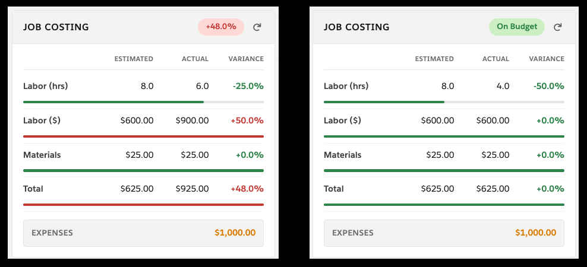

# SFS Job Costing LWC

<p align="center">
  
</p>

A Lightning Web Component for Salesforce Field Service that provides real-time cost tracking directly on the Work Order record page.

 

## What It Does

The Job Costing LWC compares estimated vs. actual spend across labor hours, labor dollars, and materials. Variance percentages and color-coded progress bars make it immediately clear which cost categories are tracking on budget and which are running over. A header badge summarizes overall budget status at a glance.

Expenses like travel, meals, and lodging are displayed in a separate section since they're can be non-billable and shouldn't distort the estimate-to-actual comparison.

**Important:** This is job *costing*, not job *profitability* - it tracks what was planned vs. what was consumed, but does not factor in billing rates, markup, or profit margins on labor or materials. It answers "did we spend what we expected?" rather than "did we make money?". To achieve true profitability analysis, you could integrate with a system of record like an ERP to pull in revenue and margin data, or add custom fields on the Work Order to capture billing rates and markup percentages, allowing the component to calculate actual profit per job.

## Data Sources

| Row | Estimated Source | Actual Source |
|-----|-----------------|---------------|
| Labor (hrs) | `WorkType.EstimatedDuration` | `TimeSheetEntry` (summed by Work Order) |
| Labor ($) | `ProductRequired` (Labor product qty x price) | Timesheet hours x labor rate from `PricebookEntry` |
| Materials | `ProductRequired` (non-Labor products qty x price) | `ProductConsumed` (qty x unit price) |
| Expenses | — | Standard `Expense` object (summed by Work Order) |

- Estimates come from `ProductRequired` records on the Work Order (falls back to `WorkType` if none exist on the WO directly).
- Prices are resolved from the Work Order's `Pricebook2Id` (falls back to the standard pricebook).

## Components

| File | Description |
|------|-------------|
| `RN_SFS_JobCostingController.cls` | Apex controller - queries estimates, actuals, and expenses |
| `RN_SFS_JobCostingControllerTest.cls` | Test class with 90%+ coverage |
| `rnSfsJobCosting/` | LWC — UI rendering, variance calculations, formatting |

## Prerequisites

- Salesforce org with **Field Service** enabled
- Products and Pricebook Entries configured (at least one "Labor" product)
- `ProductRequired` records on Work Types or Work Orders for estimates
- Standard `Expense` object enabled (available in orgs with Field Service)

## Installation

### Step 1: Clone the repository

```bash
git clone https://github.com/rafnobrega/sfs-job-costing.git
cd sfs-job-costing
```

Or download the ZIP from the green **Code** button on GitHub and extract it.

### Step 2: Authenticate your Salesforce org

If you haven't already connected your org to the Salesforce CLI:

```bash
sf org login web --set-default --alias my-org
```

This opens a browser window — log in to the org where you want to deploy.

> **Using VS Code?** You can also authenticate via the command palette: `Cmd+Shift+P` → **SFDX: Authorize an Org**.

### Step 3: Deploy to your org

**From the terminal:**

```bash
sf project deploy start --source-dir force-app -o my-org
```

**From VS Code:**

1. Open the `sfs-job-costing` folder in VS Code
2. Right-click the `force-app` folder in the Explorer sidebar
3. Select **SFDX: Deploy Source to Org**

You should see a success message confirming the Apex classes and LWC were deployed.

### Step 4: Add the component to your Work Order page

1. Navigate to any **Work Order** record in your org
2. Click the **gear icon** (Setup) → **Edit Page** to open Lightning App Builder
3. In the Components panel on the left, search for **Job Costing**
4. Drag it onto your desired location on the page layout (the right sidebar works well)
5. Click **Save**, then **Activate** (assign to your app, record type, or as org default)
6. Click **Back** to return to the record and see the component live

## Styling

The component uses SLDS-compliant colors from the [Lightning Design System](https://www.lightningdesignsystem.com):

- **Green** (`#2E844A`) — under budget
- **Red** (`#C23934`) — over budget
- **Warning** (`#DD7A01`) — expenses
- **Neutral grays** — borders, backgrounds, secondary text

## License

MIT
